# Dronage Norns Manual

Ambient drone workstation for **monome norns**.

Dronage Norns is part of the **Dronage** series. The idea began with [Dronage Terminal](https://boorch.itch.io/dronage-terminal), the original terminal drone synth and the first iteration of the series; Dronage Norns brings that sound to the norns sound computer.

Four voices built on a famous open-source macro synth module, each with its own filter, drive, fades and Euclidean trigger sequencer, fed through a shared delay / reverb / tape section. LFO Matrix with eight LFOs, a five-track CV sequencer and three macros modulate anything. Eight scenes per project, named projects on disk, a HOME screen full of live visualizers, and full **monome grid 128** support.

---

## Contents

1. [Install & launch](#1-install--launch)
2. [Make your first sound](#2-make-your-first-sound)
3. [The big picture](#3-the-big-picture)
4. [The control surface](#4-the-control-surface)
5. [Moving between screens (the minimap)](#5-moving-between-screens-the-minimap)
6. [The universal control grammar](#6-the-universal-control-grammar)
7. [Screen by screen](#7-screen-by-screen)
   - [HOME](#home)
   - [VOICE 1–4](#voice-14)
   - [EUCLID 1–4](#euclid-14)
   - [LFO 1–8](#lfo-18)
   - [MOD MATRIX](#mod-matrix)
   - [CV SEQUENCER](#cv-sequencer)
   - [DELAY · REVERB · MASTER FX](#delay--reverb--master-fx)
   - [MACRO CONTROLLER](#macro-controller)
   - [SCENES](#scenes)
   - [GLOBAL](#global)
   - [PROJECT](#project)
8. [The grid](#8-the-grid)
9. [Recipe: generative ambient](#9-recipe-generative-ambient)
10. [Cheat sheet](#10-cheat-sheet)
11. [FAQ](#11-faq)
12. [The full scale list](#12-the-full-scale-list)
13. [Credits](#13-credits)

---

## 1. Install & launch

```
;install https://github.com/boorch/dronage-norns
```

> ⚠️ **Only tested on a norns shield with a Raspberry Pi 4B.** The audio engine ships prebuilt
> 32-bit ARM binaries. Boards below Pi 4 class (original norns, Pi 3 shields) automatically get a
> lighter engine (see the FAQ); that path is untested on real hardware and best-effort.

**First run installs the audio engine,** then restarts norns to load it. You'll see an install screen; follow the prompt (**K3 = finish and restart**). After the restart, run the script again and you're in. The same screen reappears after any update that changes the audio engine - same drill, K3 and restart.

From then on dronage **checks for updates at launch** and offers to install them (see the [FAQ](#11-faq)); updating through maiden keeps working too.

---

## 2. Make your first sound

You boot into **HOME**, the transport is already **playing**, and **all four voices start silent on purpose**. Nobody wants four identical drones the second it loads.

1. On HOME, turn **E2** to highlight one of the four voice toggles along the bottom (**V1 V2 V3 V4**).
2. Press **K3** to switch that voice on. You should hear a drone.
3. Hold **K1** and turn **E2** to drop down to the **VOICE** row, release on that voice, and shape it with **E2** (pick a parameter) and **E3** (change it).

That's the whole loop: switch a voice on, open it, shape it.

---

## 3. The big picture

Four **voices** make sound. Each voice is a macro-synth oscillator with its own filter, high-pass, drive, low-pass gate, fades, pan and level, plus delay and reverb sends. **Modulation** (eight LFOs, a five-track CV sequencer, and three macros) reshapes any voice parameter over time. Everything sums into a shared **delay → reverb → tape** master chain.

**Gate mode** is the first thing to understand about a voice:

- **Drone:** the voice plays **continuously**, a held wall of sound. This is the default and the heart of what Dronage does. (A voice's **Steps** on its EUCLID screen set to *drone* = continuous.)
- **Sequenced:** set a voice's **Steps** to a number (2–16) on its EUCLID screen and it plays a Euclidean trigger pattern instead of a constant tone, plucking the voice through its low-pass gate.

If a voice seems silent even though its gate is on, check whether it's in a sequenced mode with no active steps.

**Transport (play/stop)** drives the clock: the synced LFOs, the CV sequencer, and the Euclid patterns. Drone voices sound regardless of transport; sequenced voices and clock-locked modulation need it running.

Everything you edit lives in the **current scene**. A project holds **8 scenes**, and projects are saved to disk by name (see [SCENES](#scenes) and [PROJECT](#project)).

---

## 4. The control surface

norns gives you **three encoders** (E1, E2, E3), **three keys** (K1, K2, K3), and a small screen. Dronage uses them consistently:

| Control | Default role                                                         |
|---------|----------------------------------------------------------------------|
| **E1**  | quick-flip between sibling screens in a row (on HOME: cycle visuals)  |
| **E2**  | move the cursor / pick the row or item                               |
| **E3**  | change the focused value                                            |
| **K1**  | **hold** = open the minimap to jump between screens                  |
| **K2**  | **transport play/stop** on most screens (SCENES: recall · PROJECT: save) |
| **K3**  | per-screen action: gate toggle (HOME/VOICE/EUCLID) · store (SCENES) · load (PROJECT) |
| **K2+K3** | reset / clear / delete the focused thing                          |

Global gestures, available from **any** screen:

- **K2 (hold) + E1**: **undo / redo** ([details](#undo-and-redo-k2--e1)).
- **K1+K2+K3**: **randomize the current screen** with curated, undoable dice ([details](#randomize-k1--k2--k3)).
- **K1 + E1/E2/E3**: the minimap (next section).
- **K1 + K2**: transport **play/stop** (on PROJECT: quick-save; on SCENES: **copy scene**).
- **K1 + K3 (hold) + E1**: **master volume** (on SCENES, K1+K3 is **paste scene** instead).

---

## 5. Moving between screens (the minimap)

Dronage is organised as a grid of screens. **Hold K1** to bring up the minimap, then while still holding:

- **E2**: move **up/down** between rows,
- **E3**: move **left/right** within a row,
- **E1**: step **linearly** through every screen in order.

**Release K1** to jump to the highlighted screen.

Two extras while the minimap is up:

- **K2** toggles the transport (play/stop), same as K2 on HOME - so you can start/stop from anywhere. (On PROJECT the K1+K2 quick-save wins.)
- **Hold K3** and the "minimap" label in the top-right becomes **MASTER VOL: 100%** - turn **E1** to set it; release K3 and the label reverts. Master volume is the very last gain after the whole master chain; it is never saved with scenes or projects.

You can also flip between **siblings in the same row without the minimap**: just turn **E1**. On VOICE 2 it walks V1↔V2↔V3↔V4; on LFO 3 it walks the eight LFOs; on DELAY it walks DELAY↔REVERB↔MASTER FX; on MACRO it walks MACRO↔CV SEQ↔SCENES. On MOD MATRIX the row's siblings ARE the eight LFO columns, so E1 moves the focused LFO. (One exception: on HOME, E1 cycles the visualizers.)

The grid:

| Row | Screens                                             |
|-----|-----------------------------------------------------|
| 1   | **HOME**                                            |
| 2   | **VOICE 1 · 2 · 3 · 4**                             |
| 3   | **EUCLID 1 · 2 · 3 · 4**                            |
| 4   | **LFO 1 … 8**                                       |
| 5   | **MOD MATRIX** ×8 - one cell per LFO column, so you can jump straight to any LFO's column; your destination row is kept |
| 6   | **DELAY · REVERB · MASTER FX**                      |
| 7   | **MACRO CONTROLLER · CV SEQUENCER · SCENES**        |
| 8   | **GLOBAL · PROJECT**                                |

You always know where you are: every screen with siblings draws a row of small **position dots** in its top-right corner - one per screen in that row, with yours highlighted.

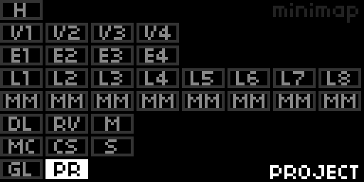

---

## 6. The universal control grammar

Most screens speak the same language, so once you learn one you know them all:

- **E2 selects**: moves the cursor down a list, or across the rows of a grid.
- **E3 sets**: changes the value the cursor is on.
- **K2 plays/stops**: on every screen except SCENES (recall) and PROJECT (save), a lone K2 toggles the transport. It acts on **release**, so any chord that includes K2 swallows it - no accidental stops.
- **K2+K3 resets**: clears the focused cell/parameter back to nothing/zero/default. (Pressing both cancels the single-key actions.)

On the **list screens** (VOICE, EUCLID, LFO, and the FX/GLOBAL panels) **K2+K3 resets the highlighted parameter** to its default. Nothing lives on columns any more: the MOD MATRIX moves its LFO column with **E1**, and the CV SEQUENCER and MACRO walk every cell linearly with **E2**.

A few screens layer their own actions on top of this (HOME, SCENES, PROJECT); those are spelled out below.

### Undo and redo (K2 + E1)

Hold **K2** and turn **E1**: **counter-clockwise = undo, clockwise = redo**. One turn is exactly one step, no matter how fast you spin - pause for a moment (or reverse direction) to take the next step. A popup names each step as you cross it ("UNDO RANDOMIZE", "REDO EDITS"), so you always know where you are.

Dronage keeps the last **10 states**. A step is either a burst of knob edits (everything you tweak within about a second becomes one step) or one big action: a randomize, a scene recall / store / initialize, a project load, or a new project. A wrong scene recall, a roll of the dice that went too far, even loading a project over unsaved work - all of it is one K2+E1 turn from recovery.

Two knobs deliberately live outside the history: the MACRO **AMOUNT** and **Master Volume** are live performance controls, so undo never yanks them out of your hands.

### Randomize (K1 + K2 + K3)

Press all three keys together (hold K1 first, then add the others) and the **current screen** rolls its own dice. Every screen randomizes only the thing it owns, with musical guardrails - and every roll is one undo step away from gone:

| Screen         | What gets rolled                                                       |
|----------------|-------------------------------------------------------------------------|
| HOME · PROJECT | nothing                                                                 |
| VOICE          | Model, Harmonics, Timbre, Morph                                         |
| EUCLID         | the whole pattern; favors 8/16/32-step totals and never lands on *drone* |
| LFO            | everything except **Mutate**; prefers synced rates. **S&H SEED** LFOs are protected: the first press re-rolls only the seed, a second press rolls seed + Length + Div, and the waveform itself is never rolled away |
| MOD MATRIX     | a fresh sparse routing for the **focused voice** (a few destinations, one LFO each). Press again to **layer more on top**; a third press starts fresh again |
| CV SEQUENCER   | the focused track: steps, division, length, both destinations           |
| DELAY          | everything, full range                                                  |
| REVERB         | everything (Shimmer lands on 10% steps, Size and Time on whole numbers) |
| MASTER FX      | Tape Age and Hiss only                                                  |
| MACRO          | all three destination slots (depths on a 25% grid); AMOUNT is untouched |
| SCENES         | recall another populated scene at random                                |
| GLOBAL         | Root, Scale and Seed                                                    |

Rolled percentages always land on whole numbers, so randomized values read clean and are easy to nudge afterwards.

---

## 7. Screen by screen

### HOME

The landing screen: the title and play/stop status up top, a **live visualizer** in the middle, and the four **voice gate toggles** along the bottom.

| Control | Action                                                              |
|---------|---------------------------------------------------------------------|
| **E1**  | cycle the 5 visualizers                                             |
| **E2**  | highlight a voice toggle (V1–V4)                                    |
| **K3**  | switch the highlighted voice on/off                                 |
| **K2**  | play / stop the transport                                           |

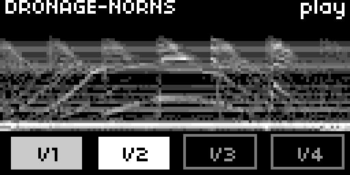

The five **visualizers** (E1 cycles them; the choice isn't saved):

1. **spectrogram**: a scrolling waterfall of the master output's spectrum.
2. **vectorscope**: a half-circle stereo-image scope (mono sits up the middle, stereo spreads to the sides).
3. **styx**: eight stacked scrolling LFO scopes.
4. **cocytus**: eight LFO history tiles.
5. **lethe**: eight bipolar LFO bars.

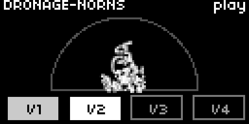

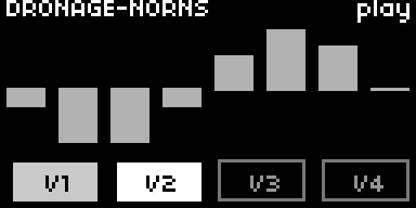

### VOICE 1–4

One screen per voice, each a scrollable list of that voice's parameters. **E2** scrolls, **E3** changes the value, **K2+K3** resets the highlighted parameter. **K3** alone toggles that voice's **gate** (regardless of which parameter is focused) so muting/unmuting a voice never requires scrolling.

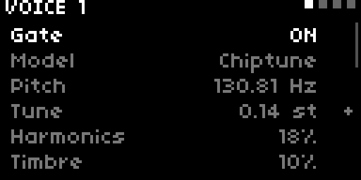

| Parameter        | What it does                                              |
|------------------|----------------------------------------------------------|
| **Gate**         | voice on / off (same toggle as HOME)                     |
| **Model**        | the synthesis model (28 macro-synth engines)             |
| **Pitch**        | base pitch, shown in Hz; scale-aware (see below)         |
| **Tune**         | post-quantizer offset, ±12.00 semitones - the vintage-detune knob (see below) |
| **Harmonics**    | macro-synth timbre control                                |
| **Timbre**       | macro-synth timbre control                                |
| **Morph**        | macro-synth timbre control                                |
| **LP Cut**       | low-pass filter cutoff                                    |
| **LP Res**       | low-pass filter resonance                                 |
| **HP Cut**       | high-pass cutoff: tame rumble, or thin a voice to sit higher |
| **Drive**        | bipolar drive / saturation                               |
| **Chorus**       | per-voice chorus depth                                    |
| **Delay Send**   | how much of the voice feeds the shared delay             |
| **Reverb Send**  | how much of the voice feeds the shared reverb            |
| **Fade In**      | fade-in time when you gate the voice on (a slow swell)   |
| **Fade Out**     | fade-out time when you gate the voice off                |
| **LPG Decay**    | low-pass-gate decay (the pluck/ring length in sequenced mode) |
| **LPG Color**    | LPG blend, pure VCA → low-pass filter as the gate closes |
| **Out**          | oscillator routing: MIX / MAIN / AUX (mono) or STEREO / INV STEREO (the model's main + aux outputs spread across L/R). On original norns the voice chain runs mono, so STEREO / INV STEREO behave exactly like MIX - they're listed as `:|` / `:(` there |
| **Pan**          | stereo placement (bipolar, centre = middle)              |
| **Level**        | voice level                                              |

**Fade In / Fade Out are not a per-note envelope.** They're the swell times for the *whole voice* when you gate it on or off. Set them slow (seconds) so voices breathe in and release gently. Bringing layers up and down slowly, by hand, is the core gesture of drone music.

**Pitch and scale:** with a scale active (set on GLOBAL), turning **Pitch** steps note-by-note through the scale. Pitch, LP Cut and HP Cut are frequency controls. Their encoder has fine detents plus turn-speed acceleration, so a slow turn nudges and a fast turn sweeps. Hold **K3** while turning **E3** on Pitch to jump in whole **octaves** (deliberately blunt: two detents per jump; the K3 release is swallowed, so it won't toggle the gate).

**Tune** is a bipolar ±12.00 st offset applied **after** the scale quantizer, in 0.01 st steps - so you can push a voice slightly (or wildly) out of tune even with a scale locked in. Hold **K3** while turning to snap to whole semitones. It is also a mod-matrix / CV-seq target (right under Pitch), which is the point: a slow sine or S&H on Tune gives the broken-vinyl / vintage-drift effect the quantizer would otherwise eat.

### EUCLID 1–4

One per voice, the voice's **Euclidean trigger sequencer**. **E2** scrolls, **E3** changes the value, **K2+K3** resets the highlighted parameter. **K3** alone toggles the bound voice's **gate** (each EUCLID drives one voice), and **K2** toggles the transport.

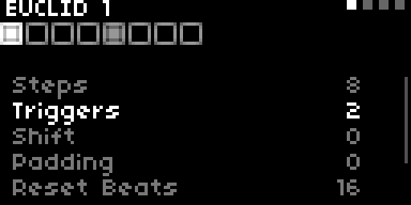

| Parameter      | What it does                                                  |
|----------------|---------------------------------------------------------------|
| **Steps**      | *drone* (continuous) or a step count 2–16 (sequenced)         |
| **Triggers**   | how many of the steps fire (the Euclidean fill)               |
| **Shift**      | rotate the pattern                                            |
| **Padding**    | extra empty steps appended to the pattern                     |
| **Reset Beats**| re-home the pattern every N beats                             |
| **Rate**       | per-track clock multiplier (1/4× … 2×)                        |
| **Probability**| chance each trigger actually fires                           |

Set **Steps** to a number and the voice plucks through its low-pass gate (shape the pluck with **LPG Decay / LPG Color** on the VOICE screen); leave it on *drone* for a held tone.

### LFO 1–8

Eight LFOs, one screen each, with a live scope of the LFO's output. **E2** scrolls, **E3** changes the value, **K2+K3** resets the highlighted parameter. (The list adapts to the LFO: **Rate** vs **Div** shows depending on Sync, and the sample-and-hold parameters only appear for the S&H shapes.)

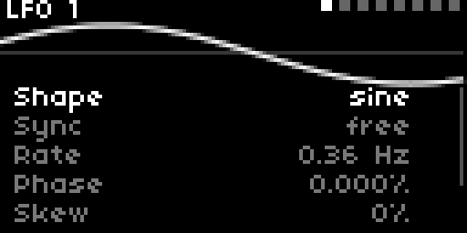

| Parameter   | What it does                                                     |
|-------------|-----------------------------------------------------------------|
| **Shape**   | Sine · Tri · Saw+ · Saw− · Square · S&H rnd · S&H seed          |
| **Sync**    | **free** (Hz) or **synced** (clock division)                    |
| **Rate**    | free-running rate in Hz (when Sync = free)                      |
| **Div**     | tempo-synced division, 8 bar … 1/32T (when Sync = synced)        |
| **Phase**   | shift the cycle start (0.125% steps; on **S&H SEED** 100% spans the whole Length, so whole steps rotate the melody). Hold **K3** + turn to snap to 3.125% = one step at Length 32 |
| **Skew**    | warp the waveform                                              |
| **Smooth**  | round the shape (softens S&H steps into glides)                 |
| **Length**  | amount of steps S&H-seed will produce before looping around                |
| **Variation**| S&H-rnd walk distance: at 0 the held value freezes; turn up for bigger random jumps |
| **Mutate**  | S&H-seed Turing-style drift of the looped table. 0% to lock the sequence, anything above proportionally increases the chances of sampling a new value for upcoming step(s)                |
| **Polarity**| bipolar (−1…+1) or unipolar (0…+1)                             |

An LFO doesn't do anything until you **route** it on the MOD MATRIX.

### MOD MATRIX

Routes the **8 LFOs** to voice parameters. The grid: each **row** is a destination (a voice's parameter), each **column** is an **LFO source (1–8)**, and each cell is a bipolar **depth**. The eight LFO scopes run along the top of the screen.

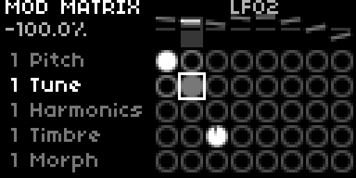

| Control   | Action                                                             |
|-----------|--------------------------------------------------------------------|
| **E2**    | move the destination row                                          |
| **E1**    | move the LFO source column (which LFO you're editing)            |
| **E3**    | set the focused cell's depth (bipolar, 0.1% steps; turn faster for coarser) |
| **K2+K3** | reset the focused cell to 0                                      |

A cell's circle is filled bright for positive depth, grey for negative. The focused cell's exact depth is shown as a percentage under the title, and the focused LFO's name sits next to the position dots.

On the minimap the matrix appears as **eight MM cells**, one per LFO column: jump into any of them and you land on the **same destination row you left**, with that cell's LFO focused - so "LFO 6 into voice 3's timbre" is one minimap jump away from anywhere.

Destinations, per voice: Pitch, Tune, Harmonics, Timbre, Morph, LP Cut, LP Res, LPG Decay, Pan and Level.

### CV SEQUENCER

A five-track stepped CV sequencer (the modular-style sequencer). Each **track** (row) has five bipolar step bars, a clock **division** and a **length**, plus **two destinations**: each destination = a voice/voice-group, a parameter, and a bipolar depth. Tracks are polymetric (each runs at its own division).

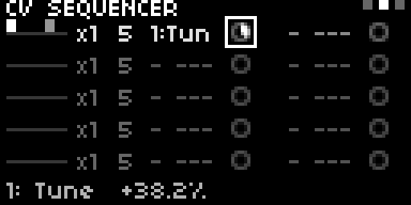

| Control   | Action                                                             |
|-----------|--------------------------------------------------------------------|
| **E2**    | walk every cell linearly, track by track (step bars · division · length · the two destinations) |
| **E3**    | edit the focused cell                                             |
| **K2+K3** | reset the focused cell                                           |

Like the matrix, the CV sequencer sums into the same modulation pool as the LFOs, so a track can drive any continuous voice parameter.

### DELAY · REVERB · MASTER FX

Three shared master-chain screens, each a simple parameter list (**E2** scroll, **E3** value, **K2+K3** reset). Flip between them with **E1**.

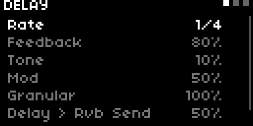

**DELAY** (the tempo-synced forward + reverse pair; a voice's positive Delay Send feeds the forward delay, a negative send feeds the reverse):

| Rate | Feedback | Tone | Mod | Granular | Delay > Rvb Send | Rev > Fwd Send |
|------|----------|------|-----|----------|------------------|----------------|

`Rate` is the synced division, `Tone` a tilt EQ, `Mod` tape wobble, `Granular` a granular texture (drives both delays). `Delay > Rvb Send` feeds both delays' wet into the reverb; `Rev > Fwd Send` feeds the reverse delay's wet into the forward delay.

**REVERB:**

| Shimmer | Size | Time | Damping | Diffusion | Feedback | Modulation |
|---------|------|------|---------|-----------|----------|------------|

**MASTER FX** (tape):

| Tape Age | Hiss | Compression | Master Volume |
|----------|------|-------------|---------------|

`Tape Age` is the single tape-wear macro: saturation rides it 1:1 from 0%, the mu-law colour tints subtly across the range, and above 50% the wow/chew/degrade artifacts ramp in (head loss last, above 75%). `Hiss` is the level of a looping tape-hiss bed that sits before the compression, so it pumps with the mix. `Master Volume` is the very last gain in the chain (100% = unity) and is **never saved** - not in scenes, not in projects.

On original norns (the lite engine, see the FAQ) the saturation, head-loss and degrade stages are skipped to fit the CPU - `Tape Age` still drives wow, chew and the colour tint, and `Hiss` / `Compression` work the same everywhere.

### MACRO CONTROLLER

One hands-on **macro**: a single bipolar **AMOUNT** you sweep live, feeding up to three **destinations** at once. Set the destinations first, then ride the amount as a performance gesture.

The screen has the bipolar **AMOUNT** gauge at the top and three destination slots below; each slot = a voice/group + a parameter + a bipolar depth.

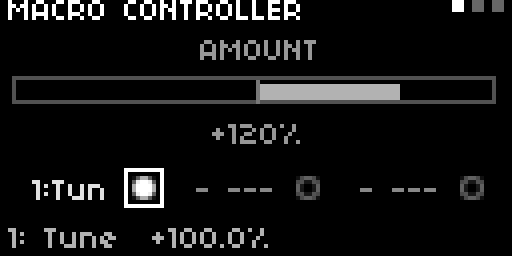

| Control   | Action                                                             |
|-----------|--------------------------------------------------------------------|
| **E2**    | walk through every focus point (AMOUNT, then each slot's cells)    |
| **E3**    | change the focused value                                         |
| **K2+K3** | reset the focused slot                                          |

`AMOUNT` runs −200%…+200% (it can over-drive or invert the macros); each slot depth is −100%…+100%. The amount returns to 0 on every scene switch, so it's always a live performance gesture, never baked into a scene.

### SCENES

Eight scene slots. A scene is a full snapshot of everything you edit: all four voices, the Euclid sequencers, the LFOs, the CV sequencer, the macros, and the global section. Every action acts on the **highlighted** slot.

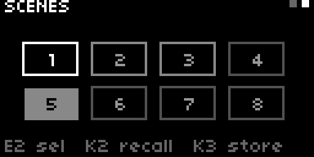

| Control   | Action                                                             |
|-----------|--------------------------------------------------------------------|
| **E2**    | highlight a slot (1–8)                                            |
| **K3**    | **store** the current state into the highlighted slot            |
| **K2**    | **recall** (switch to) the highlighted slot                      |
| **K2+K3** | **initialize** the highlighted slot: wipe it to defaults (asks first) |

Switching scenes saves your current work back into the slot you're leaving, so each scene keeps its own edits. The clock is **per scene**, so different scenes can run at different tempos. All 8 scenes are saved as part of a project.

**Copy and paste** (SCENES screen only): **K1+K2** copies the current scene as you hear it right now, unsaved tweaks included; **K1+K3** pastes it into the **highlighted** slot. The compose loop this enables: build scene 1, copy, highlight slot 2, paste, keep composing, copy again, paste to 3... Paste is undoable, and since the paste chord owns K1+K3 here, the master-volume hold (K1+K3+E1) is unavailable on this one screen.

Initializing a scene is destructive, so it asks first with a full-screen **INITIALIZE SCENE N?** (K2 = no, K3 = yes), the same confirmation as project overwrite and delete. Storing over **another** slot's saved snapshot asks too (**OVERWRITE SCENE N?**); storing into the current slot never asks - that's the routine "save my tweaks".

### GLOBAL

Project-wide settings. A simple list (**E2** scroll, **E3** value, **K2+K3** reset).

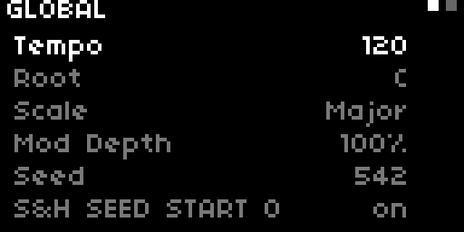

| Parameter            | What it does                                          |
|----------------------|-------------------------------------------------------|
| **Tempo**            | master clock BPM (per scene)                          |
| **Root**             | musical root note (C … B)                             |
| **Scale**            | scale for pitch quantization                          |
| **Mod Depth**        | global scaler on all modulation                       |
| **Seed**             | the random/S&H seed (K1+K2+K3 here, or on an S&H SEED LFO's screen, re-rolls it) |
| **S&H Seed Start 0** | pin the first step of every S&H SEED loop to 0, so seeded melodies always start from the unmodulated base note |
| **Grid Brightness**  | 3-level LED dimmer for the attached monome grid (this row only appears while one is connected; never saved - a live-room knob like master volume) |

`Root` and `Scale` set the musical grid: with a scale active, voice **Pitch** steps note-by-note and stays in key; set `Scale` to **Off** for chromatic pitch.

### PROJECT

Save, load, and manage projects on disk. A project is the eight scenes plus all settings, stored under a name.

The list shows **+ new project** at the top, then your saved projects (a dot marks the loaded one).

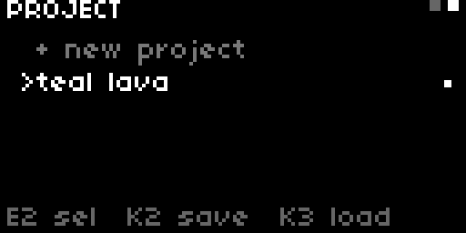

| Control   | Action                                                             |
|-----------|--------------------------------------------------------------------|
| **E2**    | scroll the list                                                   |
| **K2**    | on **+ new project** = **save as new** (name it); on a saved one = **overwrite** it (with a confirmation) |
| **K3**    | on **+ new project** = start a fresh project; on a saved one = **load** it (asks about unsaved changes) |
| **K2+K3** | **delete** the highlighted project (with a confirmation)          |
| **K1+K2** | **quick-save** under a random name (no typing)                    |

**Naming a project** uses the norns text keyboard, pre-filled with a random atmospheric name you can keep or edit (E2 picks letters, E3 jumps to DEL/OK, K3 types/confirms, **K2 cancels**). Names are capped at 20 characters.

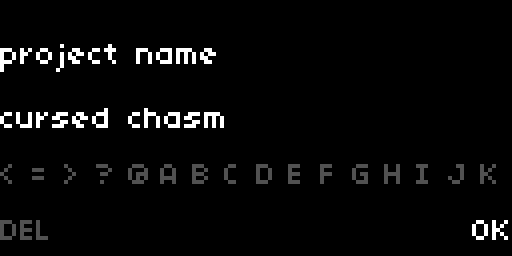

**Overwrite / delete / load confirmations** are full-screen: **K2 = no, K3 = yes**. Loading a project or starting a new one asks **LOSE UNSAVED CHANGES?** first, since it replaces the live state - and even a confirmed load or new is still undoable afterwards with **K2+E1** (deleting a project's file is not).

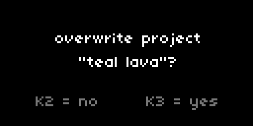

---

## 8. The grid

Plug in a **monome grid 128** (16×8, varibright) and dronage mirrors itself onto it. The grid is strictly optional - without one, nothing changes - and it never invents features: every pad drives the exact same actions as the keys and encoders, through the same dialogs, the same undo history, and the same per-parameter feels.

```
      1    2    3    4    5    6    7    8    9   10   11   12   13   14   15   16
 1 | HOME  ·    ·    ·    ·    ·    ·    ·    ·    ·    ·    ·   S1   S2   S3   S4
 2 |  V1   V2   V3   V4   ·    ·    ·    ·    ·    ·    ·    ·   S5   S6   S7   S8
 3 |  E1   E2   E3   E4   ·    ·    ·    ·    ·    ·    ·    ·    ·    ·    ·    ·
 4 |  L1   L2   L3   L4   L5   L6   L7   L8   ·    ·    ·    ·    ·    ·    ·    ·
 5 |  MM   MM   MM   MM   MM   MM   MM   MM   ·    ·    ·    ·  RST  RND   NO  YES
 6 |  DLY  RVB  MST  ·    ·    ·    ·    ·    ·    ·    ·    ·  SHF  MAP  UNDO REDO
 7 |  MAC  CV   SCN  ·    ·    ·    ·    ·    ·    ·    ·    ·   +    ◀◀    ▲   ▶▶
 8 |  GLB  PRJ  ·    ·    ·    ·    ·    ·    ·    ·    ·    ·   -    ◀     ▼    ▶
```

One rule to trust everywhere: **an unlit pad does nothing.** Every pad that does something is at least faintly lit, and brightness always means something - dim = present/inactive, bright = active/current, blinking = a dialog is waiting.

### The left side: the minimap in hardware

The left eight columns are the [minimap](#5-moving-between-screens-the-minimap), pad for pad: press any cell and you jump to that screen. The pads are alive:

- **V1-V4** breathe with each voice's gate fade (a swelling voice literally brightens over its Fade In seconds); in sequenced mode they flash on every actual trigger, decaying with LPG Decay. **Hold SHIFT and press one to toggle that voice's gate** from anywhere.
- **L1-L8** glow with each LFO's live value, the whole modulation section visible at a glance.
- **MM ×8** jump into the mod matrix with that pad's **LFO column focused**, landing on the same destination row you last used - "LFO 6 into voice 3" is one press away from anywhere.
- The current screen's pad is boosted so you always know where you are.

### The scene pads (S1-S8)

Top-right, matching the SCENES screen's own 2×4 layout. **Press = recall** that scene (the current one shows bright). With **SHIFT held** they become the clipboard: **hold a pad ~1.5 s to COPY that scene** (the pad ramps up and lands bright when the copy arms), **tap a pad to PASTE into it**. Copying the active scene captures the live state, tweaks included; pastes are one undo step.

### The control block (bottom-right 4×4)

| Pad | Does |
|-----|------|
| **▲ ▼** | move the cursor, exactly like E2. On CV SEQUENCER: pick the track; on SCENES: move between slot rows |
| **◀ ▶** | move horizontally where the screen has a horizontal: MOD MATRIX = LFO column, CV SEQUENCER = cell, MACRO = slot cells, SCENES = across slots, HOME = voice toggles. Dark elsewhere |
| **◀◀ ▶▶** | previous / next sibling screen, wrapping (hold to flip through all eight LFOs); on HOME they cycle the visualizers |
| **+ −** | nudge the focused value, exactly like E3 - same per-parameter feel, scale-aware pitch stepping included. Hold for key-repeat that starts slow and accelerates |
| **SHF** | the modifier. Held: **+/−** go coarse (much faster, and 10× faster still on matrix depths), **▲/▼** on the matrix jump a whole voice (same parameter), voice pads toggle gates, scene pads copy/paste. **Tapped alone**: the screen's K3-style action - gate toggle on HOME/VOICE/EUCLID, store on SCENES, load on PROJECT |
| **MAP** | hold = the minimap pops up on the norns screen; steer the highlight with the arrows, release to jump there |
| **UNDO REDO** | one history step per tap, same 10-level history as K2+E1 |
| **RST** | the screen's K2+K3 reset: parameter to default, matrix/CV cell to zero, scene initialize / project delete (their confirm dialogs appear; answer with YES/NO) |
| **RND** | roll the current screen's [dice](#randomize-k1--k2--k3) |
| **NO YES** | answer an open dialog. Otherwise **YES = play** (lit while playing), **NO = stop** (lit while stopped); on SCENES, YES recalls the highlighted slot, and on PROJECT it loads the highlighted project |

While anything owns the norns screen (a text keyboard, the update prompt, the system menu), the whole grid goes politely inert.

### The visualizer

**Hold HOME for 2 seconds** and the grid becomes a slow star-field driven by the actual sound: stars exist and brighten with each voice's gate fade, sit high or low with its (post-modulation) pitch, and twinkle faster as its filter opens. Every euclid trigger sparks; every note that appears or moves gets a soft halo around it; routed LFOs shimmer in their own columns. Everything blends additively. **Any pad press returns to the controls.**

It also starts on its own after a period of no activity - the **grid idle visualizer** time lives in the norns PARAMETERS menu (default 15 minutes, 0 = never).

### Grid brightness

The GLOBAL screen gains a **Grid Brightness** row while a grid is attached: 3 = full (default), 2 = dimmed, 1 = night. It scales every LED on the surface, is never saved anywhere, and lit pads stay visibly lit even at the lowest setting.

---

## 9. Recipe: generative ambient

The trick is to let sample-and-hold LFOs choose notes for you while the **scale quantizer keeps everything in key**, so the result is musical even though it's generative.

1. **Set the key.** On GLOBAL, pick a `Root` and a `Scale` (a minor or pentatonic makes every note land well). Leave it on, not OFF.
2. **Design a few voices.** Give each VOICE a role: a lead, a bass, a pad. Keep them on *drone* (EUCLID `Steps` = drone) and use slow **Fade In / Fade Out** so they breathe.
3. **A melody from a long S&H LFO.** On an LFO screen, set `Shape` to **S&H seed** and `Length` to **16** (a 16-note phrase), and pick a synced `Div`. On the MOD MATRIX, route that LFO into the lead voice's **Pitch** with a moderate depth - now you have a 16-step pattern. Set `Mutate` to around 10% to let the pattern drift: a small change each time it loops.
4. **Bass and chords from shorter S&H LFOs.** Set another LFO's `Length` to **4** and route it to the bass voice's Pitch with a smaller depth; do the same for a pad. Different lengths and divisions make the lines drift against each other and never repeat.
5. **Slow transposition from the CV sequencer.** Give one CV-SEQUENCER track a few stepped values aimed at a voice's Pitch and a slow division, so it shifts the whole line through the scale over time while still staying in key.
6. **Perform and capture.** Re-roll the random lines by pressing **K1+K2+K3** on the S&H LFO's own screen (it rolls just the seed; on GLOBAL the same chord also rolls Root and Scale). Ride the **MACRO** amount live. A roll you don't like is one **K2+E1** turn from undone. When a combination sings, **store it to a scene** (SCENES, K3) and build a set to move between.

Start with modest depths and slow rates. The magic is in the interplay of a few quantized, out-of-phase lines, not in any single busy one.

---

## 10. Cheat sheet

**Navigation**

| Do                          | To                                            |
|-----------------------------|-----------------------------------------------|
| hold **K1** + E2/E3/E1      | open the minimap, move, release to jump       |
| **E1**                      | flip between sibling screens (HOME: visuals · MOD MATRIX: LFO column) |

**Universal grammar**

| Do          | To                                                        |
|-------------|-----------------------------------------------------------|
| **E2**      | select / move the cursor or row                          |
| **E3**      | change the focused value                                 |
| **K2**      | transport play/stop (SCENES: recall · PROJECT: save)     |
| **K3**      | per-screen action (gate toggle / store / load)           |
| **K2+K3**   | reset / clear / delete the focused thing                 |
| **K2 + E1** | undo (CCW) / redo (CW), one step per turn                |

**Per-screen highlights**

| Screen        | K2              | K3              | K2+K3            |
|---------------|-----------------|-----------------|------------------|
| HOME          | play / stop     | toggle gate     | -                |
| VOICE · EUCLID | play / stop    | toggle that voice's gate | reset parameter |
| MOD MATRIX    | play / stop     | -               | reset cell (E1 = LFO column) |
| CV SEQUENCER  | play / stop     | -               | reset cell (E2 walks all cells) |
| MACRO         | play / stop     | -               | reset slot       |
| SCENES        | recall slot     | store slot      | initialize (confirm) |
| PROJECT       | save / overwrite| load / new      | delete           |
| LFO · FX · GLOBAL | play / stop | -               | reset parameter  |

**Global chords**

| Do          | To                              |
|-------------|---------------------------------|
| **K1+K2+K3**| randomize the current screen (undoable) |
| **K2 + E1** | undo / redo                     |
| **K1+K2** (SCENES) | copy the current scene    |
| **K1+K3** (SCENES) | paste to highlighted slot |
| **K1+K2** (PROJECT) | quick-save, random name  |
| **K1+K2** (elsewhere) | transport play/stop      |
| **K1+K3** hold + E1 | master volume (not on SCENES) |
| **K3** (VOICE/EUCLID) | toggle that voice's gate |
| **K3** + E3 (Pitch) | jump in octaves          |
| **K3** + E3 (Tune)  | snap to whole semitones  |
| **K3** + E3 (Phase) | snap to 3.125% steps     |

---

## 11. FAQ

**Q. I launched it and there's no sound. Is it broken?**

No. Dronage boots silent on purpose so you don't get four identical drones at once. On HOME, turn **E2** to a voice toggle and press **K3** to switch it on.

**Q. I press play and nothing changes.**

Drone voices play continuously, so the transport doesn't affect them. Play/stop drives the synced LFOs, the CV sequencer, and the Euclid patterns. Set a voice's **Steps** (EUCLID) to a number, or use a synced LFO, to hear the transport do something.

**Q. I'm shaping an LFO and the rate/shape knobs work, but nothing moves.**

You shaped it but didn't route it. An LFO does nothing until you point it at a parameter on the **MOD MATRIX**: pick the destination row (E2) and the LFO column (E1), then dial a depth with E3.

**Q. Why do LPG Decay and LPG Color seem to do nothing?**

The low-pass gate only opens and closes when the voice is **triggered**, so the LPG controls have nothing to act on while a voice is a *drone*. Set that voice's **Steps** (EUCLID) to a number so it plucks, and both become live.

**Q. I recalled a scene / loaded a project / rolled the dice and lost what I was doing.**

Hold **K2** and turn **E1** counter-clockwise. Dronage keeps a 10-step history of everything musical - knob edits (grouped by gesture), randomizes, scene changes, even full project loads - so one turn steps straight back; clockwise is redo. The two exceptions are the MACRO amount and Master Volume (live performance knobs, never touched by undo) and deleting a project's file from disk, which is permanent.

**Q. How do I move between all these screens quickly?**

Hold **K1** and use E2 (rows) / E3 (within a row) / E1 (linear), then release. Or, to stay in a family, just turn **E1** to flip between siblings (the four voices, the eight LFOs, the three FX screens).

**Q. Does it run on original norns (or a Pi 3 shield)?**

Best-effort. The full engine needs more CPU than a CM3/Pi 3 core has, so below Pi 4 class the script automatically loads a **lite engine**: the tape saturation, head-loss and degrade stages are skipped (`Tape Age` still drives wow, chew and the colour tint) and each voice's filter chain runs mono, with the chorus doing the stereo widening - which is why the STEREO / INV STEREO out modes behave exactly like MIX there and are listed as `:|` / `:(`. Everything else is identical, and projects move between full and lite devices losslessly: a STEREO voice saved on a shield survives a round-trip through an original norns untouched. Lite hasn't been tested on real hardware yet.

**Q. How do updates work?**

At launch, dronage quietly checks whether a newer release exists (it never blocks - the check runs in the background and only ever shows something if there's news). If an update is available you get a full-screen **UPDATE AVAILABLE** prompt: **K2 = later, K3 = update**. K3 pulls the update and reloads the script; if the release changed the audio engine you'll then see the familiar install screen (K3 = restart) and you're done. The check only happens when the script was installed via maiden/git, the files are unmodified, and the norns is online - otherwise it silently skips and boots as normal. If you installed by copying files to the SD card by hand, you'll never see the prompt; update the same way you installed. Updating through maiden's project manager also still works exactly as before.

**Q. Does it work with a monome grid?**

Yes - a grid 128 gets a full control surface: every screen one press away, cursor/value pads, scene launch and copy/paste, undo/redo, the randomizer, and a generative visualizer. See [the grid](#8-the-grid). No grid needed for anything, and smaller grids (64) are not supported.

**Q. Where do projects live?**

On the norns, in `dust/data/dronage-norns/`. Saving and loading are done entirely from the **PROJECT** screen.

**Q. The save dialog won't go away.**

Press **K2** to cancel the norns text keyboard, or finish naming with **K3** on **OK**.

---

## 12. The full scale list

The **Scale** parameter on GLOBAL offers **64 scales**, plus **Off** (no quantization, fully chromatic). The chosen scale snaps every voice's pitch to its degrees, relative to the **Root**. Microtonal scales are tuned exactly, so a 19-EDO step or a just-intonation third lands between the usual twelve semitones.

**Equal-tempered (12-TET).** The familiar scales and modes:

Chromatic (first after Off - a plain 12-TET semitone snap), Major, Minor, Harm Minor, Melodic Min, Dorian, Phrygian, Lydian, Mixolydian, Locrian, Maj Pent, Min Pent, Whole Tone, Blues, Maj Bebop, Dor Bebop, Mixo Bebop, Altered, Dim W-H, Dim H-W, Harm Major, Hung Major, Hung Minor, Neap Major, Neap Minor, Lydian Min, Maj Locrian, Lead Whole, 6-Tone Sym, Dbl Harmonic, Enigmatic, Overtone, Prometheus.

**World and exotic (12-TET):**

Persian, Oriental, Balinese, Purvi, Spanish 8, Gagaku, In Sen, Okinawa, Hirajoshi, Iwato, Fifths.

**Microtonal** (exact alternate tunings):

19-EDO, 22-EDO, 31-EDO, Pythagorean, 7-lim JI, QC Meantone, Kirnberger, Vallotti, Werckmeister, Makam Rast, Maqam Rast, Dastgah 17, Thai 7-TET, Drone 5ths, Harm Series, Sub Series, LMY WTP, Eikosany, Hexany 1357, Hexany 1379.

---

## 13. Credits

Dronage Norns stands on some excellent open-source DSP - vendored, and tastefully modified where it served the sound:

- **Plaits** by Mutable Instruments (Émilie Gillet) - the macro oscillator behind every voice. On top of it, four home-made custom engines: **Hyper**, **VCous**, **VCtar** and **Combust**.
- **mi-UGens** (Volker Böhm) - the SuperCollider wrapper our vendored oscillator grew from.
- **ChowDSP** analog-tape models (Jatin Chowdhury, via Mads Kjeldgaard's portedplugins) - the MASTER FX tape stage.
- **Greyhole** (Julian Parker, sc3-plugins) - the reverb, wrapped in our own octave-shimmer feedback loop.
- **SuperCollider** - the engine underneath all of it.

Full attribution and license texts: `LICENSES.txt`.
